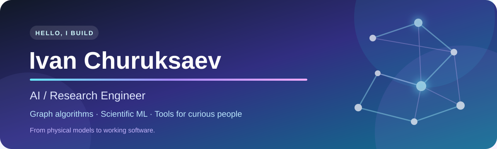

  

  
  
  

> Мне интересно не просто обучить модель, а понять устройство задачи: какую часть лучше решить классическим алгоритмом, какую доверить данным и где проходит граница между красивой гипотезой и полезным результатом.

Я превращаю исследовательские идеи в работающие системы — от маршрутизации на больших графах и ML-моделей для материалов до редактора научных документов внутри VS Code. Физическое образование научило меня мыслить через модели, допущения и эксперименты; инженерная практика — доводить идеи до кода, интерфейса и воспроизводимого пайплайна.

<table>
  <tr>
    <td width="33%" valign="top">
      <h3>🧭 Graph Intelligence</h3>
      Маршрутизация, агломерация графов, анализ сложных сетей и гибриды классических алгоритмов с ML.
    </td>
    <td width="33%" valign="top">
      <h3>🧪 Scientific ML</h3>
      Вычислительная физика, DFT-данные, суррогатные модели и эксперименты, которые можно воспроизвести.
    </td>
    <td width="33%" valign="top">
      <h3>🛠️ Useful Software</h3>
      Local-first инструменты, автоматизация документов и интерфейсы, превращающие сложный процесс в понятный продукт.
    </td>
  </tr>
</table>

## ✦ Опыт

### AI Engineer · 2022–2025

Три года я решал прикладные ML-кейсы, в основном для банковского домена и скоринга. Работу начинал не с выбора «модной модели», а с постановки задачи: целевая переменная, метрика, качество данных, признаки и честная схема валидации. Затем сравнивал подходы, исследовал ошибки и разбирался, почему результату можно — или нельзя — доверять.

Этот опыт научил меня одинаково внимательно относиться к качеству модели, интерпретируемости решения и воспроизводимости эксперимента.

## ✦ Избранные проекты

### 🧭 GARA — когда граф слишком велик для привычного маршрута

**Graph Agglomeration Routing Algorithm** — мой исследовательский проект об ускорении маршрутизации в больших взвешенных графах без превращения приближённого метода в чёрный ящик.

GARA сохраняет точную структуру там, где она важнее всего, а удалённые области объединяет в крупные блоки. Маршрут строится по компактному представлению сети с использованием структурных и статистических признаков. Главный вопрос здесь — честный **Pareto-компромисс между временем, сжатием и ошибкой маршрута**.

Я исследую переносимость подхода на новые размеры, источники, распределения весов и топологии; адаптивную агломерацию, многоуровневые представления и локальный exact fallback для сложных запросов.

`Python` `NetworkX` `Graph Algorithms` `Machine Learning` `Numerical Experiments`

---

### 📄 Автоматизированный документооборот — из одной анкеты в готовый договор

Система связывает в один процесс веб-анкету, базу данных, административную проверку и автоматический выпуск документов. После заполнения формы приложение склоняет русские ФИО для разных разделов договора, подставляет данные в абзацы и таблицы DOCX, преобразует результат в PDF и выдаёт готовый файл.

Так один источник данных управляет всем документом, а повторный ручной ввод исчезает.

`Python` `Flask` `SQLAlchemy` `MySQL` `pymorphy2` `python-docx` `PDF`

---

### ✍️ [Petya Markdown Studio](https://github.com/ivchuruksaev/petya-markdown-studio) — Overleaf-подобная среда внутри VS Code

Local-first редактор, в котором один `.md`-файл живёт сразу в режимах **Code, Split и Visual** — без скрытых копий и обязательного облака. Внутри: синхронный preview, KaTeX, таблицы, outline, проектные ссылки, история версий, checkpoints, сравнение редакций и редакторская диагностика.

Проект распространяется как VSIX, проверяется через CI и имеет собственную продуктовую страницу и подробную документацию для разработчиков.

`JavaScript` `VS Code API` `Webview` `Markdown` `KaTeX` `GitHub Actions`

---

### ⚗️ [HEA Energy Adsorption Screening](https://github.com/ivchuruksaev/HEA-energy-adsorption) — ML для поиска перспективных сплавов

Пятикомпонентные высокоэнтропийные сплавы выбираются из 19 металлов — напрямую рассчитать всё пространство слишком дорого. Я связал DFT-результаты, teacher model и интерпретируемые линейно-квадратичные и графовые модели, чтобы анализировать и воспроизводить ранжирование перспективных составов.

Особое внимание уделил фиксированным разбиениям, learning curves, кросс-валидации, экспорту метрик и документации данных.

`Python` `pandas` `scikit-learn` `GNN` `DFT Data` `Reproducible ML`

---

### 🕸️ [СоциоГраф](https://github.com/ivchuruksaev/Socio) — увидеть организацию как живую сеть

Интерактивная карта связей между людьми и подразделениями. СоциоГраф строит иерархические сети, находит сообщества и помогает увидеть лидеров, посредников и изолированные части организации через PageRank, betweenness, closeness и clustering coefficient.

`Python` `Streamlit` `NetworkX` `Plotly` `Community Detection`

---

### 🔬 [HF Solid State](https://github.com/ivchuruksaev/HF-solid_state) — мост между физикой и вычислениями

Исследовательский проект о применимости метода Хартри — Фока и полуэмпирических приближений к физике твёрдого тела. Я работал с геометрией кристаллов и данными JARVIS, ставил эксперименты в Jupyter и сопоставлял результаты с VASP.

`Python` `Jupyter` `Computational Physics` `VASP` `JARVIS`

---

### 🌐 [IPRAN Network Simulation](https://github.com/ivchuruksaev/IPRAN)

Моделирование сетевых топологий с задержками, кольцевыми связями, визуализацией и поиском кратчайших маршрутов. Один из практических шагов от сетевого моделирования к исследованию GARA.

## ✦ Образование

<table>
  <tr>
    <td width="50%" valign="top">
      <h3>🎓 Магистратура · Университет ИТМО</h3>
      <strong>Advanced Quantum and Nanophotonic Systems</strong> 
      16.04.01 «Техническая физика» · англоязычная программа  
      Квантовая оптика, нанофотоника, электродинамика, физика твёрдого тела и численные методы.
    </td>
    <td width="50%" valign="top">
      <h3>🎓 Бакалавриат · Университет ИТМО</h3>
      <strong>Лазерные технологии</strong> 
      12.03.05 «Лазерная техника и лазерные технологии»  
      Физико-математическая подготовка, моделирование, экспериментальная работа и инженерное мышление.
    </td>
  </tr>
</table>

## ✦ Стек

  
  
  
  
  
  
  
  
  
  
  

Помимо этого, я делал внутренние информационные системы, аналитику опросов, Telegram-ботов и исследовательские прототипы в областях DFT, Cosmo-RS и квантово-вдохновлённых вычислений.

---

  <strong>Сейчас мне особенно интересны research engineering, графовые алгоритмы, scientific ML и гибридные системы, в которых классические методы работают вместе с обучаемыми компонентами.</strong>

